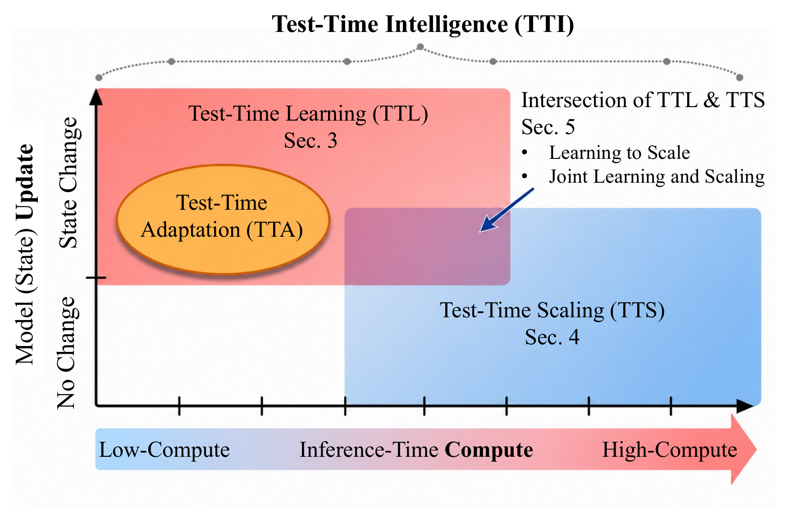
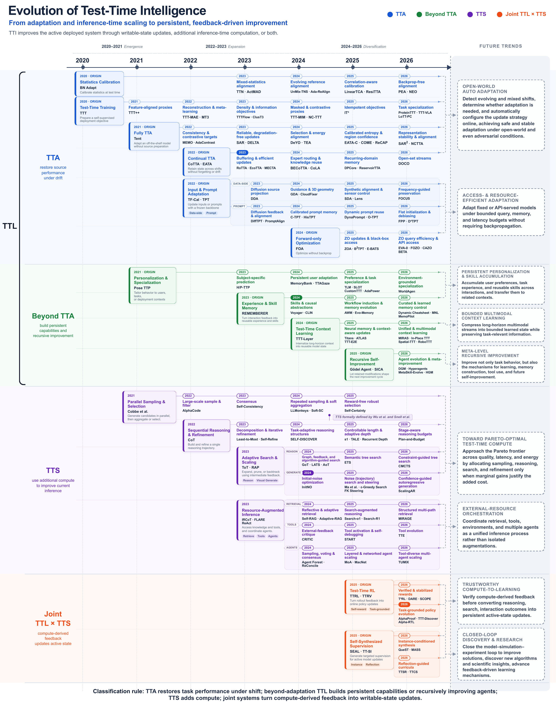

# Awesome Test-Time Intelligence [](https://awesome.re)

The official paper collection for **A Survey on Self-Improving Test-Time Intelligence: Feedback-Driven Adapting, Learning, and Scaling at Inference**.

<p align="center">
  
</p>

Test-time intelligence improves an active deployed system through feedback-driven state updates, additional inference-time computation, or both. This collection brings together test-time learning, test-time scaling, their intersection, and applications across domains.

[Browse by topic](#browse-by-topic) · [All papers](ALL_PAPERS.md) · [Contributing](CONTRIBUTING.md) · [Citation](#citation)

## Browse by topic

| Topic | Scope | Unique papers |
| --- | --- | ---: |
| [Test-Time Learning](TTL.md) | Learning from test-time inputs and feedback by updating parameters, representations, modules, or memory. | 282 |
| [Test-Time Scaling](TTS.md) | Improving current inference through additional reasoning, sampling, search, tools, or external resources w/o model state change. | 84 |
| [Learning and Scaling](Intersection_TTL_TTS.md) | Using inference compute for later learning, learning to allocate compute, and combining both during deployment. | 59 |
| [Applications](APPLICATIONS.md) | Applying TTI across vision, generative models, language, robotics, agents, and healthcare. | 101 |

**487 unique papers** across four complementary views. See the [complete index](ALL_PAPERS.md).

<p align="center">
  <a href="./assets/tti_evolution_timeline.png">
    
  </a>
</p>

## Contributing

Suggestions for relevant papers, official implementations, and corrections are welcome. See the [contribution guide](CONTRIBUTING.md) to propose an addition or report an issue.

## Citation

If this survey is useful to your research, please cite:

```bibtex
@article{niu2026TTI,
  title={A Survey on Self-Improving Test-Time Intelligence: Feedback-Driven Adapting,
    Learning, and Scaling at Inference},
  author={Niu, Shuaicheng and Chen, Guohao and Chen, Yaofo and Wen, Zhiquan and Hu,
    Jinwu and Deng, Zeshuai and Chen, Deyu and Zhang, Shuhai and Chen, Renjie and Lian,
    Zihao and Xu, Shoukai and Luo, Wei and Tan, Mingkui and Deng, Cheng},
  journal={Machine Intelligence Research},
  year={2026}
}
```

## Related Resources

- [Awesome Test-Time Adaptation](https://github.com/tim-learn/awesome-test-time-adaptation) — a complementary collection focused on test-time adaptation under distribution shifts.
